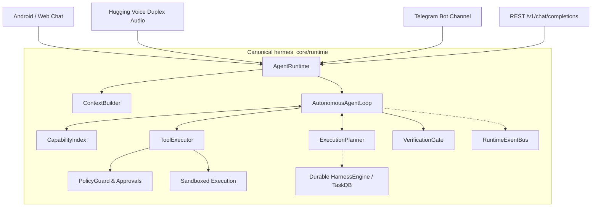

# Sovereign Autonomous Agent Runtime Architecture

## 1. Executive Overview

Hermes-x is transformed from a rule-assisted, prompt-hardcoded chatbot into a genuinely autonomous, sovereign, model-driven AI agent runtime.

In this architecture:
- **The Model is Sovereign**: The LLM is solely responsible for understanding user intent, deciding whether action is required, discovering system capabilities, selecting tools, planning multi-step work, executing actions, observing tool outcomes, recovering from failures, re-planning, verifying completion against empirical evidence, and generating the final response.
- **Application Code is Infrastructure**: Application code does NOT simulate intelligence using Python `if/elif` string keywords (e.g. `if "ls" in prompt`, `is_greeting_or_fast`, `is_coding`, `if "notion" in prompt`). Instead, application code provides deterministic capabilities, sandboxed execution, permission gates, persistent state, networking, and safety boundaries.
- **Single Canonical Execution Pipeline**: Every interface—Web Chat, Android Jetpack Compose app, Hugging Voice Duplex Audio, Telegram bots, and REST APIs—converges on a single canonical execution path: `hermes_core.runtime.AgentRuntime`.

## 2. Core Principles

1. **Elimination of Rule-Based Fallbacks**: No canned placeholder messages (`"I have received your request..."`), no synthetic server health checks on failure, and no keyword-driven short-circuits.
2. **True Tool Autonomy**: If the user asks "What files are in the directory?", the model chooses to call `list_dir` or `bash`. If the user asks a conversational question, the model responds directly without tool invocation.
3. **Empirical Verification**: The agent cannot claim a task is completed unless verified by the `VerificationGate` using real disk state, return codes, and test assertions.
4. **Resilience & Loop Protection**: Repeated tool calls with identical parameters that fail repeatedly trigger automatic loop breaker exceptions and force re-planning.
5. **Deterministic Security**: All tool calls pass through `PolicyGuard` and trust hierarchy authorization before invocation.
