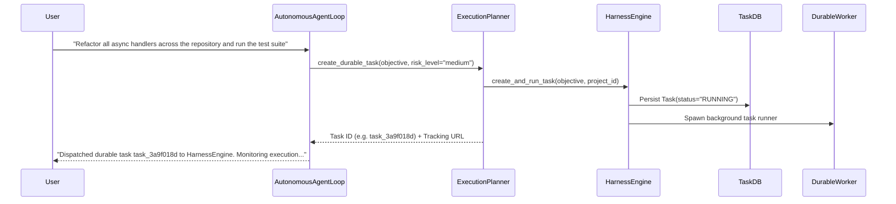

# Long-Running Task Integration

## 1. Bridging Ephemeral Chat to Durable HarnessEngine

Conversational turns are bound to immediate request/response lifecycles. When an objective requires multi-step autonomous work, extensive compilation, repository-wide audits, or scheduled recurrence, the model delegates to `create_durable_task` (`hermes_core/runtime/planner.py`).

## 2. Architecture & Lifecycle

## 3. Resilience & Checkpointing

- **Task Checkpointing**: `TaskDB` saves state checkpoints after each major subtask.
- **Process Isolation**: The background task runs independently of whether the user closes their Android app, disconnects from Wi-Fi, or navigates away.
- **Progress Streaming**: Real-time progress is streamed via SSE (`/v1/tasks/{task_id}/events`) and can notify mobile push channels upon completion.
