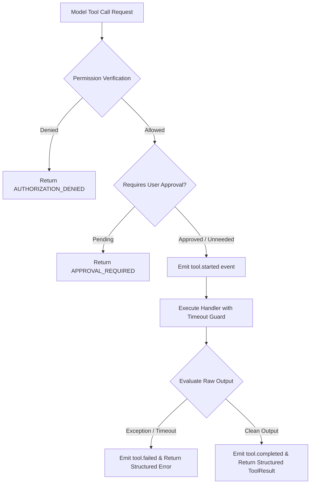

# Tool Execution Pipeline & Safety Gates

## 1. Authoritative Tool Execution

All tool execution across Hermes routes through `ToolExecutor` (`hermes_core/runtime/tool_controller.py`).

## 2. Safety & Governance Features

1. **Permission RBAC**: Tools declare permissions (e.g. `coding.write`, `system.admin`). User execution contexts are verified before handler dispatch.
2. **Approval Enforcement**: Destructive or high-risk actions (e.g. `rm -rf`, database migrations, file deletions) trigger `ApprovalRequiredError` or create pending approval records in `TaskDB` for human sign-off.
3. **Execution Timeouts**: Every tool defines a deterministic execution timeout (default: 120s; commands: up to 600s). `asyncio.wait_for` terminates runaway processes safely.
4. **Structured Results**: Tools always return a typed `ToolResult` containing:
   - `success`: boolean
   - `tool`: tool name string
   - `result`: output data or text
   - `error`: structured error dictionary `{code, message}`
   - `metadata`: duration in milliseconds
